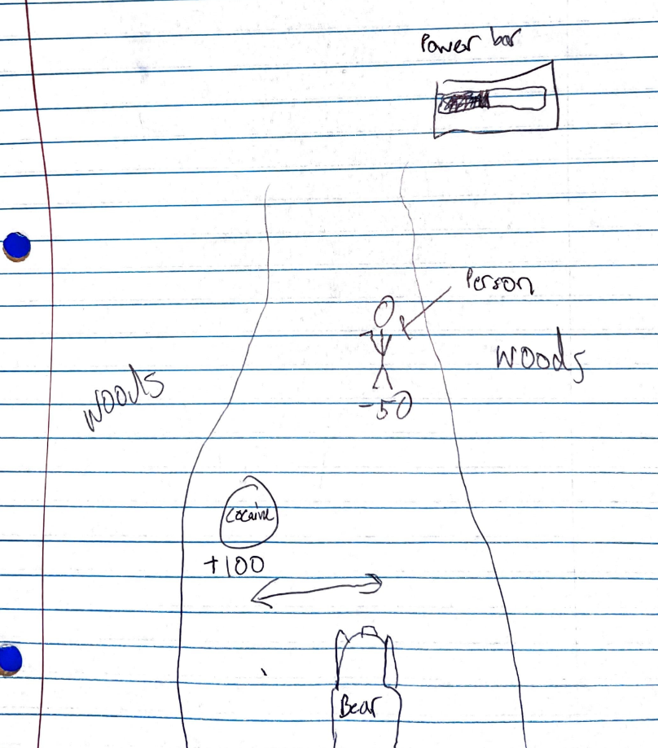
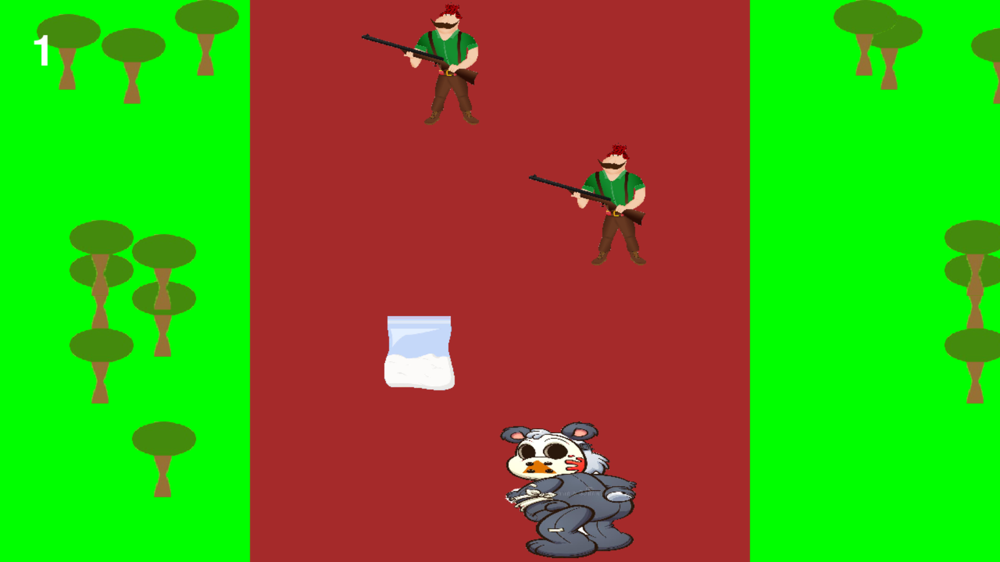
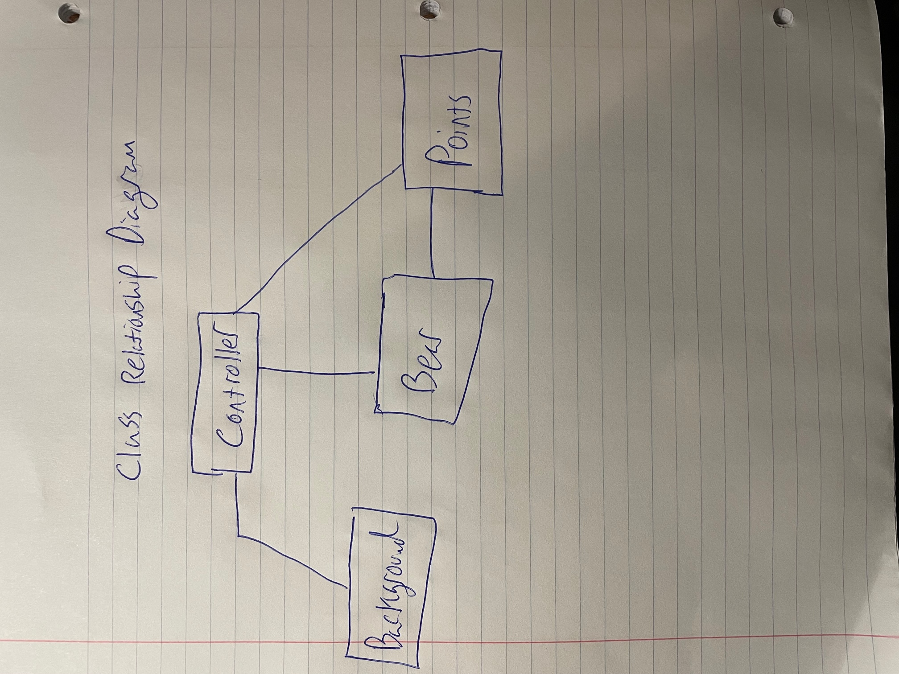

#  COCAINE BEAR: The Video Game 

## Alex Szczepanski and Michael Sternbach 

## Project Description

***    A first person game where the player is playing as the infamous "cocaine bear". The bear is placed on a moving background and will try to hit as many piles of cocaine as possible, with each bag of cocaine eaten giving a point. As the bear is running it will confront by hunters and if it goes to close to the hunter it will be shot and killed. In order to win the player must aquire 50 bags of cocaine (50 points) while not coming into contact with the hunter. Whether the player wins or lose they will have a chance to play again or close out of the screen. The player only needs to you the left and right keys on the keyboard to play the game.

## Additional Modules
pygame_menu https://pygame-menu.readthedocs.io/en/4.4.2/ 

## GUI Design

### Initial Design

### Final Design

## Program Design

### Features

1. Main menu
2. moveable bear character 
3. obstable collisions 
4. background 
5. game over

### Classes

- Controller Class - Runs the code bulk of the code for the game It has a mainloop, menuloop, gameloop, winloop and lossloop. The mainloop is responsible for switching between screens. The menuloop initializes the main menu and allows the player to eneter the game. The gameloop displays the actual game itself with all the objects on the screen. It also allows the player to move around and count how many points the player aquired. The win and loss loops are initialzed based on whether the player wins or loses.
- Bear Class - Initializes the bear object by providing the height, width, x, y coordinates, and the picture of the bear. It also updates the position of the bear so the bear can move accross the screen
- Points Class - Initializes the coke/hunter oject by providing the height, width, x, y coordinates, and the picture of the coke/hunter. It also adjusts their position so they can move down the screen. 
- Background Class - Initializes the tree ojects by providing the height, width, x, y coordinates, and the picture of the tree. It also adjusts their position so they can move down the screen. 

### Class Design

